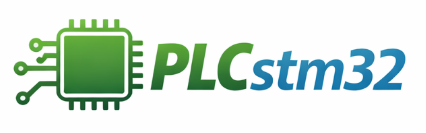
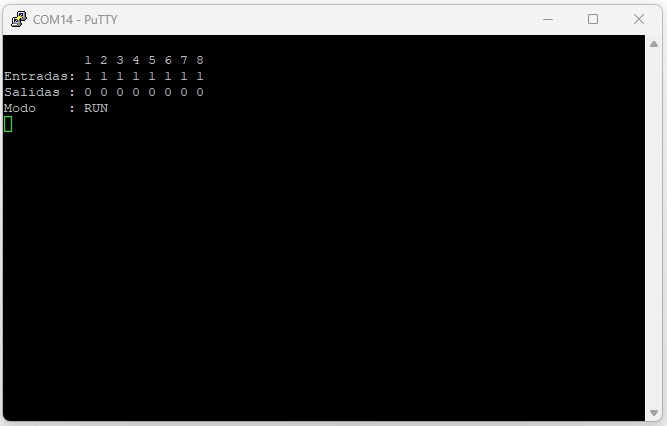
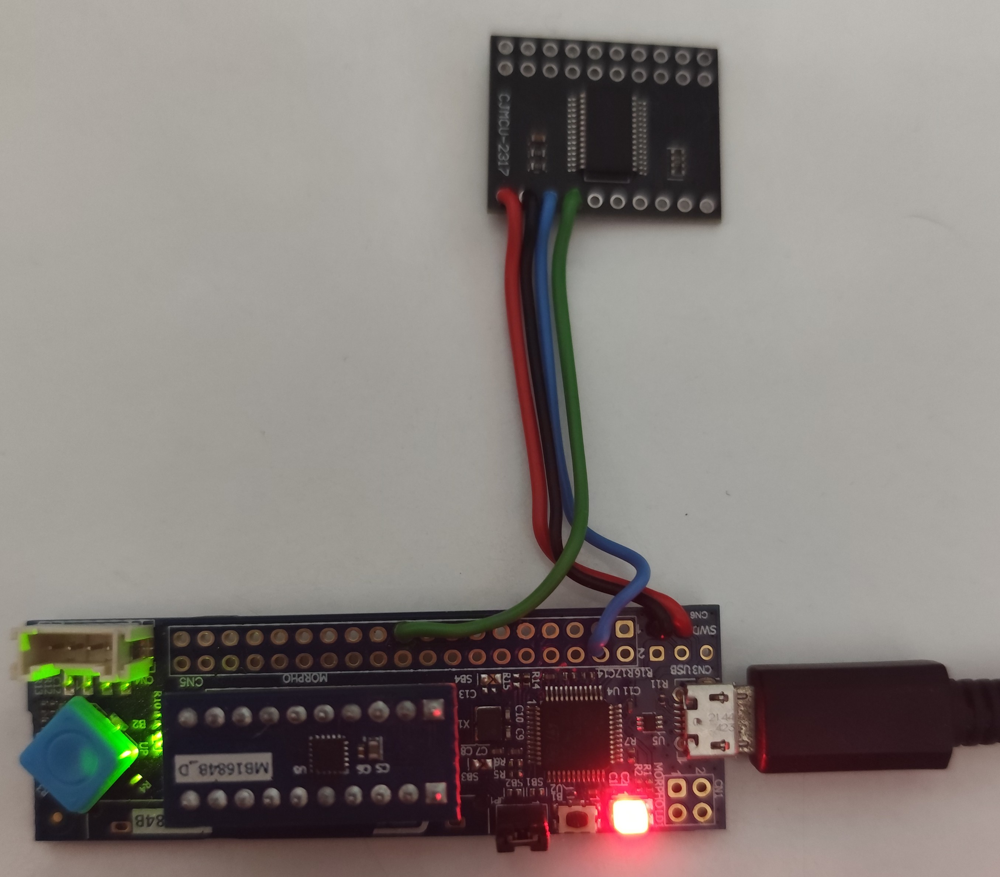
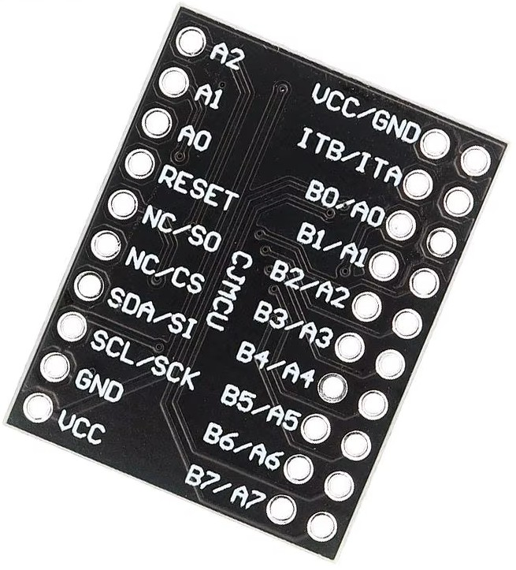
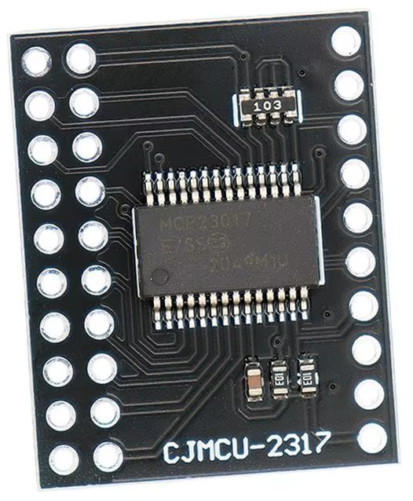
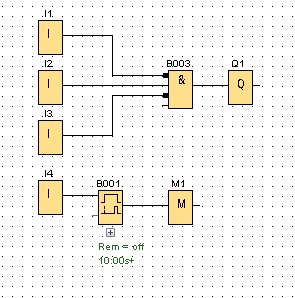
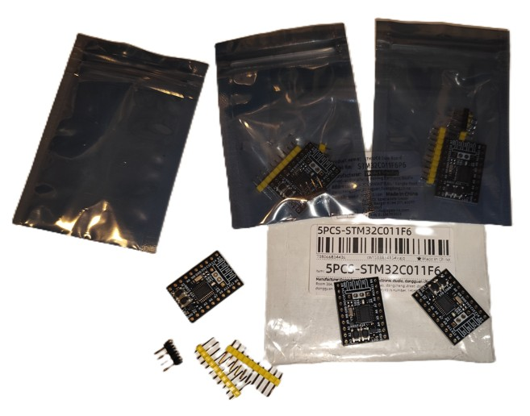
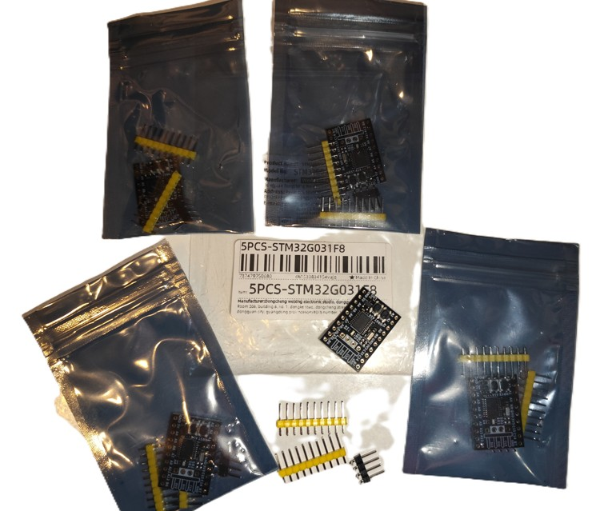

# Mini PLC con STM32C0 

## Descripción

Este proyecto implementa un **miniPLC básico** utilizando la placa de desarrollo STM32C0116-DK.

El objetivo es reproducir el funcionamiento fundamental similar pero no igual a un Siemens LOGO! 8, ejecutando lógica tipo **FBD (Function Block Diagram)**. La idea es realizar el núcleo de un miniPLC económico y funcional para el aprendizaje e investigación de automatización. En un futuro se podría desarrollar una PCB para hacerla totalmente funcional (fuente de alimentación, adaptación de señales de entradas/salidas para poder automatizar)

El miniPLC ejecuta un **ciclo de scan clásico**, leyendo entradas, ejecutando el programa del usuario y actualizando las salidas.

El programa FBD se puede cargar mediante **comunicación serie (UART)**, donde el usuario envía el programa que posteriormente es interpretado por el firmware. En principio no se contempla el desarrollo del software en entorno grafico para el PC ... dejándolo en el aire por si alguien se anima. Se realizara un script en Python para que envié el código del usuario por el puerto serial al PLCstm32.

Mediante un terminal será posible monitorizar el estado del sistema, incluyendo entradas y salidas, emulando el comportamiento de la interfaz de pantalla.

Se intentara optimalizar para tener los máximos bloques de funciones disponibles y líneas de programación para el código del usuario pero todo dependerá de lo que ocupe el firmware y la RAM que se use ,en un futuro se podría escalar a uno de mayor capacidad pero el proyecto esta pensado en el  STM32C0 sobre todo por el bajo coste y en principio hay que adaptarse a el. 

Se usara el oscilador interno tipo RC con la precisión que se dispone según las características del chip. Puede ser que los tiempos no sean precisos. Se vera la posibilidad de poner un oscilador externo pero no es el objetivó del proyecto incluir mas componentes externos excepto de E/S para usar la placa de desarrollo STM32C0116-DK

## Hardware

Placa utilizada 🧪STM32C0116-DK disponible por distribuidores y desarrollada por ST que utiliza el microcontrolador STM32C011F6  con arquitectura ARM Cortex-M0+ con una capacidad de flash de 32Kb, RAM 6Kb, con periféricos; 2 x USART, I2C, SPI, timers, ADC, RTC, DMA, 2-3.6 V.

Se utiliza  externo tipo CJMCU-2317 con el chip MCP23017 comunicado por el I2C, para disponer de una ampliación de entradas y salidas. Se valorara la posibilidad de ampliar E/S o de usar solo pines del STM32C0.

## Recursos del miniPLC

Entradas digitales: (8) I0 – I7 
Salidas digitales: (8) Q0 – Q7 
Marcas internas de memoria: (64) M0 – M63 
Numero de bloques: 300 (Se vera posibilidad de ampliar, depende del código y recursos posiblemente a 512) 

Se puede conectar salida de un bloque a la entradas de otros bloques.

## 🪜 Tipos de funciones soportadas 
Puertas lógicas, detectar francos, temporizadores, contadores, basculas ( Posible se añadirá mas funciones)
  
-  AND
-  OR
-  NAND  
-  NOR  
-  NOT  
-  RISE
-  FALL
-  TON
-  TOF
-  TP 
-  BLINK
-  SWEEP
-  SWEEP_EDGE
-  RANDOM
-  CTU  
-  CTD  
-  RS

## Funcionamiento del PLCstm32

El sistema implementa el ciclo clásico utilizado en PLC industriales.

1. Inicialización del sistema
2. Lectura de entradas
3. Ejecución del programa del usuario
4. Actualización de salidas
5. Espera hasta el siguiente ciclo

## Modos funcionamiento

   

## PLCstm32 Kernel

Motor principal y responsable de:  

- Ciclo de scan 
- Leer y analizar los bloques
- Ejecución de los bloques
- Gestión de memoria  
- Comunicaciones
- Interrupciones
  
## 🧩 Ejemplo **FBD**
  
Ejemplo similar en Logo! 8:  
  
AND con I1, I2, I3 (I1 y I3 negadas) →  Q0 
I4 Ton (10 Seg.) →  M1

Bloques:

## 🧩 Ejemplo de código a enviar por puerto serial

Bloque 0  
//  AND 3 entradas, negando entradas 1 y 3 salida Q1

op = OP_AND, 
In1 = SIG_I(0), 
In2 = SIG_I(1), 
In3 = SIG_NONE, 
In4 = SIG_I(3), 
out = SIG_Q(1), 
param_A = 0, 
param_B = NEG1 | NEG3  

Bloque 1 
// TON 10 segundos entrada I4, salida M1

op = OP_TON | TIME_1S, 
in1 = SIG_I(4), 
out = SIG_M(1), 
param_A = 10, 
param_B = 0 

## 📚 Recursos posibles de usar del MCU

-  Interrupciones
-  Comunicación UART, I2C
-  Temporizadores
-  Contadores
-  Oscilador interno tipo RC

## 📌 Notas

- El RTC no se utilizará en este proyecto, ya que el microcontrolador no dispone de pin VBAT. Por tanto, al perder la alimentación el reloj se reiniciaría.

- Este proyecto podría escalarse en el futuro a microcontroladores como la serie STM32C5, donde se implementarán funcionalidades adicionales como:

  - Comunicación CAN Bus, RS485
  - Uso de RTC con respaldo de batería
  - Ampliación con mas bloques de programación para el usuario
  - Uso de bits y registros persistentes frente a pérdidas de alimentación
  - Poder gestionar señales analógicas

## 🎯 Objetivos del proyecto

Este proyecto nace con varios objetivos claros:

- 📚 Desarrollar un miniPLC con poco recursos, con un microcontrolador de STMicroelectronics.
- 💻 Aprender programar en lenguaje C
- 🔄 Migrar conocimientos y técnicas previos de ASM a lenguaje C
- 🧪 Experimentar con diferentes periféricos y tecnologías (I2C, GPIO, CAN, etc.)

- Este proyecto no tiene como objetivo, en esta fase inicial, la adaptación de entradas/salidas al entorno físico (optoacopladores, relés, fuentes de alimentación, etc.)

- El enfoque está centrado exclusivamente en servir como prueba de concepto para la implementación de diagramas de bloques funcionales (FBD - Function Block Diagram) en un microcontrolador de poco coste y recursos.
    
## 🚧 Estado del proyecto

El proyecto está en desarrollo activo, por lo que es posible encontrar:

- Código en evolución
- Cambios actualizados 
- Mejoras continuas en la documentación
    
## 🧠 Filosofía

Este repositorio no solo busca resultados finales, sino también compartir el proceso de aprendizaje, incluyendo errores, pruebas y soluciones.

La idea es que cualquiera pueda seguir el camino, aprender y, si lo desea, aportar mejoras.

## 💡Otras opciones de desarrollo

Se está considerando adaptar el diseño para que también pueda utilizarse en PCBs que incorporan los referencias STM32C011F6 y STM32G031F8.

## 🤝 Contribuciones

Si encuentras algún error en el código o tienes alguna sugerencia, no dudes en comentarlo.

Toda ayuda es bienvenida — este proyecto también forma parte de mi proceso de aprendizaje 🚀

## 🚀 Mi trayectoria con los microcontroladores

He trabajado durante más de 10 años con microcontroladores de Microchip, principalmente programando en ensamblador (ASM).

Después de una pausa de unos 8 años sin tocar este mundo, he decidido retomarlo con un nuevo enfoque: empezar a trabajar con microcontroladores de ST y, al mismo tiempo, aprender el lenguaje C.

Esto supone para mí un doble reto:

- Adaptarme a una nueva plataforma y microcontroladores
- Aprender un nuevo lenguaje de programación para mi

## 🙏 Agradecimientos

Este proyecto desarrollado utilizando hardware STM32C0116-DK proporcionado por **STMicroelectronics** a través de LabGluon en un concurso de su canal.

Menciones especiales a:

⭐ LabGluon, Angel

  - 🧪 [GitHub @LaboratorioGluon](https://github.com/LaboratorioGluon)
  - 📺 [YouTube Laboratorio Gluon](https://www.youtube.com/@LaboratorioGluon)
  - 🎮 [Twitch twitch.tv/labgluon](https://twitch.tv/labgluon)

⭐ ST al señor David Villena

  - 🧪 [@STMicroelectronics](https://github.com/STMicroelectronics)

Agradezco su apoyo y colaboración en el desarrollo de este proyecto, así como la información proporcionada. También agradezco a todas las personas que deseen participar o contribuir al mismo.

## 📄 Licencias

Este proyecto utiliza diferentes licencias según el tipo de contenido:

### 🔧 Código (firmware y librerías propias)
El código desarrollado específicamente para este proyecto (lógica de aplicación, implementación FBD, etc.) está licenciado bajo la MIT License.

Permite:
- Uso comercial
- Modificación
- Distribución

Más información: https://opensource.org/licenses/MIT

### ⚠️ Código de terceros (STMicroelectronics)  
  
Este proyecto puede incluye código generado mediante STM32CubeIDE, así como librerías HAL y CMSIS proporcionadas por STMicroelectronics.  
  
Dicho código está sujeto a sus propias licencias, principalmente SLA0044:  
  
https://www.st.com/resource/en/license_agreement/sla0044-stm32cube-software-license-agreement.pdf  
  
Las condiciones específicas se encuentran indicadas en los encabezados de cada archivo fuente.

### 📚 Documentación y tutoriales

Licenciados bajo Creative Commons Atribución-NoComercial-CompartirIgual 4.0 Internacional (CC BY-NC-SA 4.0).

Esto significa que:
- Puedes compartir y adaptar el contenido
- Debes dar crédito al autor
- No puedes usarlo con fines comerciales
- Debes mantener la misma licencia

Más información: https://creativecommons.org/licenses/by-nc-sa/4.0/

El uso de la documentación y tutoriales en productos comerciales no está permitido sin autorización explícita del autor.
